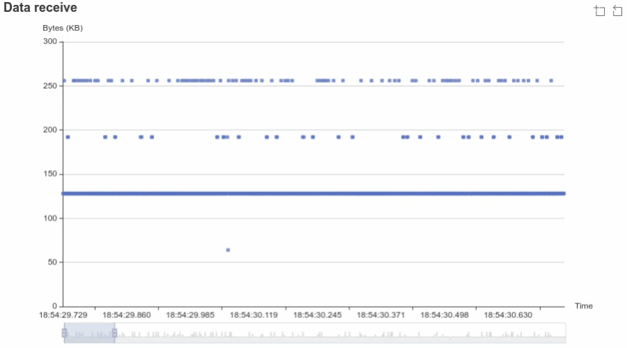

A utility to measure/track network microbursts. 

[Microbursts](https://www.qacafe.com/resources/what-is-a-microburst-and-how-to-detect-them/) can trigger various kinds of issues, especially in cloud environments like in [AWS](https://docs.aws.amazon.com/AWSEC2/latest/UserGuide/monitoring-network-performance-ena.html) where a given guranteed baseline bandwidth per second may not be allowed to be bursty (like can't send all data in few milliseconds, it will have to be sent by spreading over entire 1000ms etc)

This utility measures the microbursts efficiently using eBPF (i.e., no packet captures) using given aggregation window and displays them either realtime in TUI graph and/or HTML graphs for offline analysis:

Console output with chart:

```
$ sudo ./network-microburst --burst-window 1ms
```

Transitioning from no traffic to smooth traffic to bursy traffic:


Console output with chart disabled:

```
$ sudo ./network-microburst --burst-window 1ms --show-graph=false
...
19:21:29.470: rx: 13 MB      tx: 13 MB
19:21:29.471: rx: 12 MB      tx: 12 MB
19:21:29.472: rx: 12 MB      tx: 12 MB
19:21:29.473: rx: 12 MB      tx: 12 MB
19:21:29.475: rx: 12 MB      tx: 12 MB
19:21:29.476: rx: 11 MB      tx: 11 MB
19:21:29.477: rx: 13 MB      tx: 13 MB
19:21:29.478: rx: 12 MB      tx: 12 MB
19:21:29.479: rx: 12 MB      tx: 12 MB
19:21:29.480: rx: 2.4 MB     tx: 2.4 MB
19:21:30.464: rx: 394 kB     tx: 394 kB
19:21:30.465: rx: 2.1 MB     tx: 2.1 MB
19:21:30.466: rx: 2.5 MB     tx: 2.5 MB
19:21:30.468: rx: 2.6 MB     tx: 2.6 MB
19:21:30.469: rx: 3.2 MB     tx: 3.2 MB
19:21:30.470: rx: 9.9 MB     tx: 9.9 MB
19:21:30.471: rx: 12 MB      tx: 12 MB
19:21:30.472: rx: 13 MB      tx: 13 MB
19:21:30.473: rx: 14 MB      tx: 14 MB
19:21:30.475: rx: 13 MB      tx: 13 MB
19:21:30.476: rx: 13 MB      tx: 12 MB
19:21:30.477: rx: 13 MB      tx: 13 MB
19:21:30.478: rx: 13 MB      tx: 13 MB
19:21:30.479: rx: 12 MB      tx: 13 MB
...
```

Charts for offline analysis:

```
sudo ./network-microburst --burst-window 1ms --save-graph-html test.html
```

Bursty traffic:
[](graphs/bursty.html)

Smooth traffic:
[](graphs/smooth.html)

## Installation

You can download from the [Release](https://github.com/surki/network-microburst/releases/latest)

Alternatively, to compile from source, there are two options:

1. Building on the host.
    1. Install prerequisites: `clang`, `gcc`, `go`
    2. Build
       ```
       make
       ```

2. Building using docker (no dependencies required on the host, other than docker)

   ```
   make release
   ```

   This will produce two static binaries under `release` directory: `network-microburst-arm64` and `network-microburst-x86_64`


## Usage

> **_NOTE:_** To simulate network microbursts, we can use iperf3:
>
> 
> On the server side:  
> ```  iperf3 -s ```
>
> On client side (which can be in same machine for trying out this tool)  
>   To trigger microburst (this sends 1GB on each second starting):  
> ```     iperf3 -c 127.0.0.1 -b 1G --pacing-timer 1000000 -t 10```
>
>   To smoothly send traffic (this sends 1GB, splits and sends data every 100us):  
> ```     iperf3 -c 127.0.0.1 -b 1G --pacing-timer 100 -t 10```
>

To track network transfers (tx/rx) at 1ms interval and show the graph:

```
sudo ./network-microburst --burst-window 1ms
```

To track network transfers (tx/rx) at 1ms interval and but just print them on the stdout:

```
sudo ./network-microburst --burst-window 1ms --show-graph=false
```

To track network transfers at 1ms interval, but only include measurements above 5000 bytes:

```
sudo ./network-microburst --burst-window 1ms \
   --rx-threshold 5000 --tx-threshold 5000
```

To track network transfers at 1ms interval, with 5000 bytes threshold, generate/save chart to disk:

```
sudo ./network-microburst --burst-window 1ms \
   --rx-threshold 5000 --tx-threshold 5000 \
   --save-graph-html /tmp/graph.html
```

To track network transfers at 1ms interval, but only certain interfaces:

```
sudo ./network-microburst --burst-window 1ms \
   -filter-interface eth0
```

To track only network rx:

```
sudo ./network-microburst --burst-window 1ms \
   --track-tx=false
```

To print a histogram at the end:

```
sudo ./network-microburst --burst-window 1ms \
   --print-histogram
```
